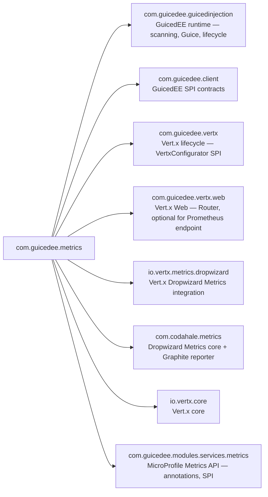

# GuicedEE Metrics

[](https://github.com/GuicedEE/Metrics/actions/workflows/build.yml)
[](https://central.sonatype.com/artifact/com.guicedee/metrics)
[](https://www.apache.org/licenses/LICENSE-2.0)


Production-ready **application metrics** for [GuicedEE](https://github.com/GuicedEE) using **Vert.x 5 Dropwizard Metrics** and the **MicroProfile Metrics 5.1 API**.
Annotate your methods with standard `@Counted`, `@Timed`, and custom `@MetricMethod` — interceptors are bound through Guice AOP, metrics are collected into a shared `MetricRegistry`, and a Prometheus-compatible scrape endpoint is exposed on the Vert.x Web `Router` automatically.

Built on [Vert.x Dropwizard Metrics](https://vertx.io/docs/vertx-dropwizard-metrics/java/) · [MicroProfile Metrics](https://github.com/eclipse/microprofile-metrics) · [Dropwizard Metrics](https://metrics.dropwizard.io/) · [Google Guice](https://github.com/google/guice) · JPMS module `com.guicedee.metrics` · Java 25+

## 📦 Installation

```xml
<dependency>
  <groupId>com.guicedee</groupId>
  <artifactId>metrics</artifactId>
</dependency>
```

<details>
<summary>Gradle (Kotlin DSL)</summary>

```kotlin
implementation("com.guicedee:metrics:2.2.0")
```
</details>

## ✨ Features

- **MicroProfile Metrics annotations** — `@Counted` and `@Timed` are intercepted via Guice AOP and bridged to Dropwizard Metrics counters/timers
- **Custom `@MetricMethod`** — annotate any method to auto-increment a named counter; if the method returns a numeric type the counter value is returned
- **Vert.x Dropwizard integration** — `MetricsVertxConfigurator` configures `DropwizardMetricsOptions` on the `VertxBuilder` before Vert.x starts, enabling built-in event bus, HTTP server/client, pool, and datagram metrics
- **Annotation-driven configuration** — `@MetricsOptions` on any class or package configures the registry name, JMX, base name, monitored URIs, Graphite, and Prometheus
- **Environment variable overrides** — every `@MetricsOptions` attribute can be overridden via system properties or environment variables
- **Prometheus scrape endpoint** — `PrometheusMetricsConfigurator` registers a `GET /metrics` handler that renders all Dropwizard metrics in Prometheus exposition format
- **Graphite reporting** — built-in `GraphiteReporter` sends metrics to a Graphite server at a configurable interval
- **JMX exposure** — metrics are optionally published as JMX MBeans
- **Extensible interceptors** — implement the `Metrics` SPI to register custom annotation → interceptor bindings discovered via `ServiceLoader`
- **Type-safe metric enumerations** — `VertxMetrics`, `HttpServerMetrics`, `HttpClientMetrics`, `EventBusMetrics`, `PoolMetrics`, `NetServerMetrics`, `DatagramMetrics` for programmatic access
- **MicroProfile MetricRegistry bridge** — `MPMetricRegistry` wraps Dropwizard's `MetricRegistry` so the standard `org.eclipse.microprofile.metrics.MetricRegistry` is injectable

## 🚀 Quick Start

**Step 1** — Annotate a configuration class with `@MetricsOptions`:

```java
@MetricsOptions(
    enabled = true,
    jmxEnabled = true,
    baseName = "my-app",
    monitoredHttpServerUris = {
        @Match(value = "/api/.*", type = Match.MatchType.REGEX, alias = "api-calls")
    },
    prometheus = @PrometheusOptions(enabled = true, endpoint = "/metrics")
)
public class MyAppConfig {
}
```

**Step 2** — Annotate methods with MicroProfile Metrics annotations:

```java
import org.eclipse.microprofile.metrics.annotation.Counted;
import org.eclipse.microprofile.metrics.annotation.Timed;

public class OrderService {

    @Counted(name = "orders-placed", tags = {"env=prod"})
    public void placeOrder(Order order) {
        // ... business logic
    }

    @Timed(name = "order-processing-time")
    public void processOrder(Order order) {
        // ... long-running logic
    }
}
```

**Step 3** — Bootstrap GuicedEE (metrics start automatically):

```java
IGuiceContext.registerModuleForScanning.add("my.app");
IGuiceContext.instance();
// Vert.x metrics are collecting
// GET /metrics returns Prometheus exposition format
```

No JPMS `provides` declaration is needed — the metrics module is registered automatically via its own service providers.

## 📐 Startup Flow

```mermaid
flowchart TD
    n1["IGuiceContext.instance()"]
    n2["IGuicePreStartup hooks"]
    n1 --> n2
    n3["MetricsPreStartup.onStartup()<br/>sortOrder = MIN_VALUE + 40"]
    n2 --> n3
    n4["Scan for @MetricsOptions annotation via ClassGraph"]
    n3 --> n4
    n5["Resolve environment variable overrides"]
    n3 --> n5
    n6["VertxConfigurator SPIs<br/>before Vert.x starts"]
    n1 --> n6
    n7["MetricsVertxConfigurator.builder()"]
    n6 --> n7
    n8["Build DropwizardMetricsOptions from @MetricsOptions"]
    n7 --> n8
    n9["Configure monitored URIs, routes, event bus handlers, client endpoints"]
    n7 --> n9
    n10["Apply to VertxBuilder via VertxOptions.setMetricsOptions()"]
    n7 --> n10
    n11["Guice injector created"]
    n1 --> n11
    n12["MetricsModule.configure()"]
    n11 --> n12
    n13["bind(MetricRegistry.class) from SharedMetricRegistries"]
    n12 --> n13
    n14["bind(MP MetricRegistry.class) via MPMetricRegistryProvider"]
    n12 --> n14
    n15["Bind CountedInterceptor for @Counted"]
    n12 --> n15
    n16["Bind TimedInterceptor for @Timed"]
    n12 --> n16
    n17["Bind MetricMethodInterceptor for @MetricMethod"]
    n12 --> n17
    n18["Load Metrics SPI for custom interceptors"]
    n12 --> n18
    n19["Setup GraphiteReporter<br/>if enabled"]
    n12 --> n19
    n20["IGuicePostStartup hooks"]
    n1 --> n20
    n21["VertxWebServerPostStartup<br/>from web module"]
    n20 --> n21
    n22["PrometheusMetricsConfigurator.builder()<br/>sortOrder = MIN_VALUE + 70"]
    n21 --> n22
    n23["Register GET handler at prometheus endpoint path"]
    n22 --> n23
```



## 📊 Metric Annotations

### `@Counted`

Increments a monotonic counter each time the method is invoked:

```java
@Counted(name = "api-requests", tags = {"endpoint=users"})
public List<User> getUsers() {
    return userRepository.findAll();
}
```

The annotation can be placed on the **method** or on the **class** (applies to all methods). If `name` is empty, it defaults to `ClassName.methodName`.

### `@Timed`

Measures method execution time with quantile snapshots:

```java
@Timed(name = "db-query-time", tags = {"table=orders"})
public List<Order> queryOrders() {
    return orderRepository.findAll();
}
```

The timer records count, min, max, mean, and percentile distributions (p50, p75, p95, p98, p99, p999).

### `@MetricMethod`

A custom GuicedEE annotation that increments a named counter. If the method returns a numeric type (`long`, `int`, `double`, `float`), the counter value is returned instead of the method's result:

```java
@MetricMethod(name = "items-processed", tags = {"source=api"})
public long processItem(String itemName) {
    // ... logic
    return 0; // replaced with current counter value
}
```

If the method has a `String` parameter, it is used as a dynamic name suffix. If `name` is empty, the string parameter becomes the metric name.

## ⚙️ Configuration

### `@MetricsOptions` annotation

Place `@MetricsOptions` on any class or package to configure the metrics subsystem:

```java
@MetricsOptions(
    enabled = true,
    registryName = "vertx",
    jmxEnabled = true,
    jmxDomain = "vertx",
    baseName = "vertx",
    monitoredHttpServerUris = {
        @Match(value = "/api/.*", type = Match.MatchType.REGEX, alias = "api")
    },
    monitoredEventBusHandlers = {
        @Match(value = "orders.*", type = Match.MatchType.REGEX)
    },
    graphite = @GraphiteOptions(
        enabled = true,
        host = "graphite.local",
        port = 2003,
        prefix = "my-app"
    ),
    prometheus = @PrometheusOptions(
        enabled = true,
        endpoint = "/metrics",
        port = 9090
    )
)
public class MyAppConfig {
}
```

| Attribute | Default | Description |
|---|---|---|
| `enabled` | `true` | Enable or disable metrics collection |
| `registryName` | `"vertx"` | Dropwizard `SharedMetricRegistries` name |
| `jmxEnabled` | `true` | Expose metrics as JMX MBeans |
| `jmxDomain` | `"vertx"` | JMX domain name |
| `baseName` | `"vertx"` | Base prefix for all metric names |
| `monitoredEventBusHandlers` | `{}` | Event bus addresses to monitor |
| `monitoredHttpServerUris` | `{}` | HTTP server URIs to monitor |
| `monitoredHttpServerRoutes` | `{}` | HTTP server routes to monitor |
| `monitoredHttpClientEndpoints` | `{}` | HTTP client endpoints to monitor |
| `graphite` | disabled | Graphite reporter configuration |
| `prometheus` | disabled | Prometheus scrape endpoint configuration |

### `@Match` configuration

Each monitored URI/handler/route uses a `@Match` annotation:

| Attribute | Default | Description |
|---|---|---|
| `value` | *(required)* | Pattern to match (address, URI, etc.) |
| `type` | `EQUALS` | `EQUALS` for exact match, `REGEX` for pattern match |
| `alias` | `""` | Optional alias for the metric name |

### `@GraphiteOptions`

| Attribute | Default | Description |
|---|---|---|
| `enabled` | `false` | Enable Graphite reporting |
| `host` | `"localhost"` | Graphite server hostname |
| `port` | `2003` | Graphite pickle protocol port |
| `prefix` | `""` | Metric name prefix |

### `@PrometheusOptions`

| Attribute | Default | Description |
|---|---|---|
| `enabled` | `false` | Enable Prometheus scrape endpoint |
| `endpoint` | `"/metrics"` | HTTP path for the scrape handler |
| `port` | `9090` | Prometheus port (informational) |

### Environment variable overrides

Every `@MetricsOptions` attribute can be overridden with a system property or environment variable:

| Variable | Overrides | Example |
|---|---|---|
| `METRICS_ENABLED` | `enabled` | `false` |
| `METRICS_REGISTRY_NAME` | `registryName` | `my-registry` |
| `METRICS_JMX_ENABLED` | `jmxEnabled` | `false` |
| `METRICS_JMX_DOMAIN` | `jmxDomain` | `my-app` |
| `METRICS_BASE_NAME` | `baseName` | `my-app` |
| `METRICS_GRAPHITE_ENABLED` | `graphite.enabled` | `true` |
| `METRICS_GRAPHITE_HOST` | `graphite.host` | `graphite.prod` |
| `METRICS_GRAPHITE_PORT` | `graphite.port` | `2003` |
| `METRICS_GRAPHITE_PREFIX` | `graphite.prefix` | `prod.myapp` |
| `METRICS_PROMETHEUS_ENABLED` | `prometheus.enabled` | `true` |
| `METRICS_PROMETHEUS_ENDPOINT` | `prometheus.endpoint` | `/prom/metrics` |
| `METRICS_PROMETHEUS_PORT` | `prometheus.port` | `9090` |

Environment variables take precedence over annotation values.

## 🔍 Programmatic Metric Access

### Inject the registries

Both Dropwizard and MicroProfile registries are injectable:

```java
import com.codahale.metrics.MetricRegistry;
import org.eclipse.microprofile.metrics.MetricRegistry;

public class MonitoringService {

    @Inject
    private com.codahale.metrics.MetricRegistry dropwizardRegistry;

    @Inject
    private org.eclipse.microprofile.metrics.MetricRegistry mpRegistry;
}
```

### Vert.x metric enumerations

Use type-safe enums to look up Vert.x metrics by name:

| Enum | Base name | Examples |
|---|---|---|
| `VertxMetrics` | `vertx` | `event-loop-size`, `worker-pool-size` |
| `HttpServerMetrics` | `vertx.http.servers.<host>:<port>` | `requests`, `connections`, `responses-2xx` |
| `HttpClientMetrics` | `vertx.http.clients` | `requests`, `endpoint.%s.ttfb` |
| `EventBusMetrics` | `vertx.eventbus` | `handlers`, `messages.sent`, `messages.pending` |
| `PoolMetrics` | `vertx.pools.<type>.<name>` | `queue-size`, `in-use`, `pool-ratio` |
| `NetServerMetrics` | `vertx.net.servers.<host>:<port>` | `open-netsockets`, `bytes-read` |
| `DatagramMetrics` | `vertx.datagram` | `sockets`, `bytes-written` |

```java
@Inject
com.codahale.metrics.MetricRegistry registry;

public long getActiveConnections() {
    return registry.getCounters()
        .get(HttpServerMetrics.CONNECTIONS.toString())
        .getCount();
}
```

Enums with placeholders provide a `format()` method:

```java
// vertx.eventbus.handlers.orders
String name = EventBusMetrics.HANDLERS_ADDRESS.format("orders");
```

## 🧩 Custom Metric Extensions

Register custom annotations and their interceptors by implementing the `Metrics` SPI:

```java
public class MyCustomMetrics implements Metrics {
    @Override
    public Map<Class<? extends Annotation>, Class<? extends MethodInterceptor>> annotations() {
        return Map.of(MyGauged.class, MyGaugedInterceptor.class);
    }
}
```

Register via JPMS:

```java
module my.app {
    requires com.guicedee.metrics;

    provides com.guicedee.metrics.Metrics
        with my.app.MyCustomMetrics;
}
```

The module declares `uses Metrics;` and discovers implementations via `ServiceLoader`. Each annotation → interceptor pair is bound in Guice AOP during `MetricsModule.configure()`.

## 📋 Prometheus Endpoint

When `@PrometheusOptions(enabled = true)` is set, a `GET` handler is registered at the configured endpoint (default `/metrics`). The response is `text/plain; version=0.0.4` in Prometheus exposition format:

```
# TYPE my_app_orders_placed counter
my_app_orders_placed 42
# TYPE my_app_order_processing_time_count summary
my_app_order_processing_time_count 15
# TYPE my_app_order_processing_time summary
my_app_order_processing_time{quantile="0.5"} 0.125
my_app_order_processing_time{quantile="0.95"} 0.350
my_app_order_processing_time{quantile="0.99"} 0.500
```

All metric types are rendered: gauges, counters, histograms (as summaries with quantiles), meters (count + rates), and timers (count + quantiles + rates).

## 📊 Monitoring Stack (Docker Compose)

A `docker-compose.yml` is provided for a local monitoring stack:

```bash
docker-compose up -d
```

This starts:

| Service | Port | Purpose |
|---|---|---|
| **Graphite** | `8080` (Web UI), `2003` (pickle) | Metrics storage and graphing |
| **Grafana** | `3000` | Dashboard visualization (login: `admin`/`admin`) |
| **Prometheus** | `9090` | Metrics scraping and alerting |

### Grafana setup

1. Login to Grafana at `http://localhost:3000`
2. Go to **Connections** → **Data Sources**
3. Add **Graphite** with URL `http://graphite:80`
4. Add **Prometheus** with URL `http://prometheus:9090`
5. Click **Save & Test**

A `prometheus.yml` is included that scrapes `host.docker.internal:9090/metrics` every 15 seconds.

## 🗺️ Module Graph



## 🧩 JPMS

Module name: **`com.guicedee.metrics`**

The module:
- **exports** `com.guicedee.metrics`, `com.guicedee.metrics.implementations`, `com.guicedee.metrics.enumerations`, `com.guicedee.metrics.implementations.mp`
- **provides** `IGuiceModule` with `MetricsModule`
- **provides** `IGuicePreStartup` with `MetricsPreStartup`
- **provides** `VertxConfigurator` with `MetricsVertxConfigurator`
- **provides** `VertxRouterConfigurator` with `PrometheusMetricsConfigurator`
- **uses** `Metrics` (SPI for custom annotation interceptors)

## 🏗️ Key Classes

| Class | Role |
|---|---|
| `MetricsOptions` | Annotation — configures registry, JMX, monitored URIs, Graphite, Prometheus |
| `Match` | Annotation — defines URI/address match patterns with `EQUALS` or `REGEX` type |
| `MetricMethod` | Annotation — marks a method as a counted metric with dynamic naming |
| `Metrics` | SPI — register custom annotation → interceptor bindings |
| `MetricsPreStartup` | `IGuicePreStartup` — scans for `@MetricsOptions` and resolves env overrides |
| `MetricsVertxConfigurator` | `VertxConfigurator` — applies `DropwizardMetricsOptions` to the `VertxBuilder` |
| `MetricsModule` | `IGuiceModule` — binds registries, interceptors, Graphite reporter |
| `CountedInterceptor` | Guice AOP `MethodInterceptor` for `@Counted` |
| `TimedInterceptor` | Guice AOP `MethodInterceptor` for `@Timed` |
| `MetricMethodInterceptor` | Guice AOP `MethodInterceptor` for `@MetricMethod` |
| `PrometheusMetricsConfigurator` | `VertxRouterConfigurator` — mounts the Prometheus scrape endpoint |
| `PrometheusMetricsHandler` | `Handler<RoutingContext>` — renders metrics in Prometheus exposition format |
| `MPMetricRegistryProvider` | Guice `Provider` — creates the MicroProfile `MetricRegistry` bridge |

## 🤝 Contributing

Issues and pull requests are welcome — please add tests for new metric types or interceptors.

## 📄 License

[Apache 2.0](https://www.apache.org/licenses/LICENSE-2.0)
